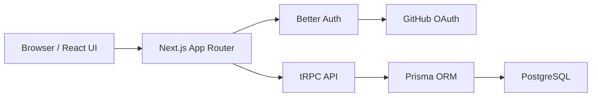

# SupportDesk

[](https://github.com/HninPhyuPhyuAye/supportdesk/actions/workflows/ci.yml)

SupportDesk is a full-stack IT support ticket application for reporting, prioritizing, and tracking technical issues. It is a portfolio project focused on type-safe web development, authentication, access control, relational data, and a future AWS deployment.

## Current features

- GitHub OAuth authentication with Better Auth
- Authenticated ticket creation
- Ticket priorities: low, medium, high, and urgent
- Ticket workflow: open, in progress, resolved, and closed
- Status updates persisted to PostgreSQL
- Combined status and priority filters
- Per-user data isolation for ticket reads and updates
- Responsive interface built with Tailwind CSS
- Runtime environment validation

## Architecture



The browser renders the React interface. Next.js handles server rendering and server actions, while tRPC provides type-safe application procedures. Prisma maps the application models to PostgreSQL. Better Auth manages GitHub OAuth, sessions, and account records.

## Technology stack

| Area | Technology |
| --- | --- |
| Application framework | Next.js 15 with App Router |
| Language | TypeScript |
| User interface | React 19 and Tailwind CSS 4 |
| API | tRPC 11 |
| Authentication | Better Auth with GitHub OAuth |
| ORM | Prisma 6 |
| Database | PostgreSQL |
| Validation | Zod |
| Data fetching | TanStack Query |
| Code quality | Biome and TypeScript |
| Local database | Docker Desktop |

## Security decisions

- Ticket procedures use `protectedProcedure`, which rejects unauthenticated requests.
- Ticket queries include the authenticated user's ID, so users receive only their own tickets.
- Status updates match both the ticket ID and authenticated user ID to prevent cross-user modification.
- OAuth state cookies are handled through Better Auth's Next.js cookie integration.
- Secrets are stored in `.env`, which is excluded from Git.
- Environment variables are validated when the application starts or builds.

## Data model

The central `Ticket` entity contains:

- `title` and `description`
- `priority` and `status` enums
- `createdAt` and `updatedAt` timestamps
- `createdById`, which relates the ticket to its authenticated user

Better Auth also manages user, session, account, and verification records.

## Local setup

### Prerequisites

- Node.js 24
- npm 11
- Docker Desktop
- Git
- A GitHub OAuth App

### 1. Install dependencies

```bash
npm install
```

### 2. Configure the environment

Copy the example file:

```bash
cp .env.example .env
```

Generate a local authentication secret:

```bash
openssl rand -base64 32
```

Add the generated value and your GitHub OAuth credentials to `.env`. Do not commit this file.

Configure the GitHub OAuth App with:

```text
Homepage URL: http://localhost:3000
Authorization callback URL: http://localhost:3000/api/auth/callback/github
```

### 3. Start PostgreSQL

Start Docker Desktop, then run:

```bash
./start-database.sh
```

The script creates or starts the local `supportdesk-postgres` container.

### 4. Apply database migrations

```bash
npm run db:generate
```

### 5. Start the application

```bash
npm run dev
```

Open [http://localhost:3000](http://localhost:3000).

## Environment variables

| Variable | Purpose |
| --- | --- |
| `DATABASE_URL` | PostgreSQL connection URL |
| `BETTER_AUTH_SECRET` | Secret used to protect authentication data |
| `BETTER_AUTH_URL` | Public base URL of the application |
| `BETTER_AUTH_GITHUB_CLIENT_ID` | GitHub OAuth client ID |
| `BETTER_AUTH_GITHUB_CLIENT_SECRET` | GitHub OAuth client secret |

## Quality checks

```bash
npm run check
npm run typecheck
npm test
npm run build
```

Next.js 16 keeps development output in `.next/dev`, separate from production build output, so development and build processes no longer overwrite each other's caches.

## Continuous integration

The GitHub Actions CI workflow runs for pushes to `main` and for pull requests. It starts a temporary PostgreSQL service, applies the committed Prisma migrations, checks Biome rules, checks TypeScript, runs the automated tests, creates a production build, and builds the production Docker image. CI uses non-production placeholder OAuth values and does not contain application secrets.

## Production container

SupportDesk uses a multi-stage Docker build and Next.js standalone output. Dependency installation and compilation happen in temporary build stages. The final image contains only the production server, static assets, and required runtime dependencies, and runs as a non-root user.

Build the image:

```bash
docker build --pull --tag supportdesk:local .
```

When building an image for the immutable ECR repository, disable BuildKit
provenance so the commit tag is attached directly to the runnable image
manifest:

```bash
docker build --pull --provenance=false --tag "supportdesk:$(git rev-parse --short=7 HEAD)" .
```

Run it against the existing PostgreSQL container:

```bash
./run-container.sh
```

Check container health from another terminal:

```bash
curl --fail http://localhost:3000/api/health
```

The run script loads the ignored local `.env` without printing secrets and changes the database hostname from `localhost` to `host.docker.internal`. This lets the application container reach the PostgreSQL port published by the existing `supportdesk-postgres` container on macOS. Production will use a private Amazon RDS endpoint instead.

## Infrastructure as code

The first Terraform root module is in `infrastructure/terraform/ecr`. It manages
the private SupportDesk container repository in the Singapore AWS region with
immutable image tags, AES-256 encryption, scan-on-push, and lifecycle cleanup.
Repository force deletion is disabled by default.

The bootstrap IAM policy in `infrastructure/bootstrap` limits the deployment
user to authenticating with ECR and managing only the `supportdesk` repository.
Terraform state and saved plans are excluded from version control.

The deployed network and RDS configuration, plus the locally tested ECS runtime
configuration, cost controls, security boundaries, availability upgrade path,
and teardown objective, are documented in
[docs/aws-architecture.md](docs/aws-architecture.md).

Run the read-only validation workflow from the ECR module directory:

```bash
terraform init
terraform fmt -check
terraform validate
terraform plan
```

`terraform apply` is intentionally a separate, explicit action because it
creates AWS resources.

## Useful database commands

```bash
npm run db:generate
npm run db:migrate
npm run db:studio
```

Prisma migrations are committed to version control so database changes are repeatable and reviewable.

## AWS deployment progress

Completed:

- Provisioned the ECR repository with Terraform
- Pushed a commit-tagged, scanned application image
- Provisioned the VPC, subnets, routes, and security groups with Terraform
- Provisioned a private, encrypted RDS PostgreSQL database with an RDS-managed secret
- Provisioned the ECS cluster, ARM64 application task definition, ALB, CloudWatch Logs, and application secret
- Kept the billable Fargate service disabled until production authentication is configured
- Built, scanned, and registered an immutable non-root ARM64 migration image and one-off task definition
- Populated the database-only application secret outside Terraform
- Ran the one-off task successfully to create the least-privilege PostgreSQL login and apply both committed migrations
- Removed the temporary migration runner and RDS master-secret permissions after the task stopped

The deployed RDS instance, ALB, and two Secrets Manager secrets currently incur
charges. No Fargate task is running yet. Remaining AWS work:

- Configure the production GitHub OAuth callback and add the authentication values to the application secret
- Run the application on Amazon ECS with AWS Fargate
- Add alarms, deployment documentation, and a recovery runbook

This roadmap is intended to demonstrate cloud provisioning, infrastructure as code, security controls, monitoring, data protection, and operational documentation.

## Planned application improvements

- Support-agent and administrator roles
- Ticket assignment and comments
- Search, pagination, and audit history
- Mobile-friendly progressive web app features
