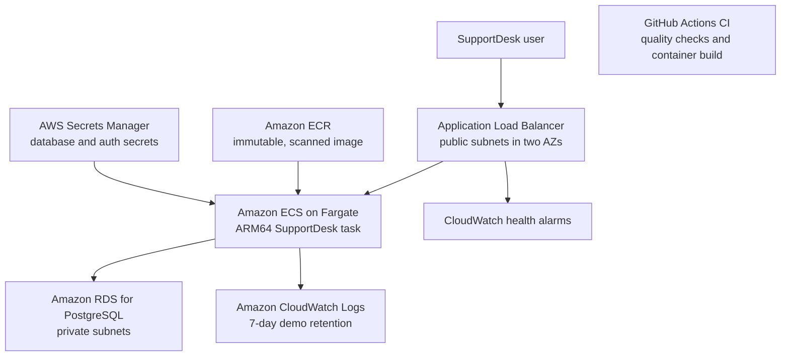

# SupportDesk AWS deployment architecture

## Status

This document describes the verified AWS runtime architecture. The short-lived
demo was successfully deployed, tested, monitored, documented, and then torn
down on 11 August 2026 to stop recurring costs. The final RDS snapshot and three
immutable ECR images remain for recovery and portfolio evidence. The complete
outcome is recorded in [aws-teardown-record.md](aws-teardown-record.md).

The first deployment will be short-lived and cost-controlled. Terraform will
also expose the settings needed to demonstrate how the design scales to a
high-availability production configuration.

## Architecture

## Network design

- Region: Asia Pacific (Singapore), `ap-southeast-1`.
- One VPC with DNS resolution and DNS hostnames enabled.
- Two public subnets in separate Availability Zones for the load balancer and
  Fargate tasks.
- Two private database subnets in separate Availability Zones for the RDS DB
  subnet group.
- An internet gateway for public ingress and task egress.
- No NAT Gateway in the demo environment. Each Fargate task receives a public
  IP for outbound access, while its security group accepts inbound traffic only
  from the load balancer security group.
- The database receives no public IP and accepts PostgreSQL traffic only from
  the Fargate task security group.

The public task IP is a deliberate demo cost trade-off. A production version
would place tasks in private subnets and use redundant NAT Gateways or VPC
endpoints for ECR, CloudWatch Logs, and Secrets Manager.

## Cost-controlled demo profile

| Component | Demo setting | Production upgrade path |
| --- | --- | --- |
| Fargate | One Linux/ARM64 task, 0.25 vCPU and 0.5 GB memory | Two or more tasks across Availability Zones with autoscaling |
| RDS | Single-AZ PostgreSQL, small Graviton instance, 20 GB general-purpose storage | Multi-AZ deployment with longer backup retention |
| Networking | No NAT Gateway; tightly restricted public task IP | Private tasks with redundant egress or VPC endpoints |
| Load balancer | One internet-facing ALB used only during the demonstration | HTTPS listener, ACM certificate, custom domain and AWS WAF where required |
| Logs | Seven-day CloudWatch retention | Retention based on compliance and operational requirements |
| Images | ECR lifecycle keeps the latest three images | Retention based on release and rollback policy |
| Monitoring | Four standard alarms with no notification actions | Route alerts to an owned SNS destination and incident workflow |

The VPC, subnets, route tables, security groups, and internet gateway do not
have an hourly charge by themselves. Fargate tasks, public IPv4 addresses, the
load balancer, RDS, Secrets Manager, and CloudWatch usage can incur charges
while deployed.

## Security controls

- Run the container as the non-root `nextjs` user.
- Use the scanned, immutable ECR image identified by a Git commit tag.
- Keep RDS private and encrypted at rest.
- Generate the database password instead of committing it to Git.
- Store application secrets in Secrets Manager and inject them into the ECS
  task at runtime.
- Create only the application secret container with Terraform and populate its
  value outside Terraform so plaintext credentials do not enter state.
- Let RDS generate and rotate its master credential in Secrets Manager so the
  plaintext password never enters Git or Terraform state.
- Reserve the database master account for controlled bootstrap and migrations;
  run the application with a separate least-privilege database user.
- Give the ECS task, ECS execution role, and GitHub deployment role separate
  least-privilege IAM policies.
- Add a future GitHub Actions deployment role through OIDC federation instead
  of storing long-lived AWS access keys.
- Restrict security-group paths to ALB-to-task and task-to-database traffic.
- Send application logs to CloudWatch without logging secret values.

## Availability and data protection

The network and load balancer span two Availability Zones from the beginning.
The demo runs one application task and a Single-AZ database to control costs.
The production profile increases the application desired count to at least two
and enables RDS Multi-AZ without redesigning the network.

RDS automated backups, deletion protection, and a final snapshot are configured.
Application and load-balancer health checks are active. CloudWatch monitors ALB
unhealthy targets, ECS CPU and memory utilization, and RDS free storage. A
recovery runbook documents database restoration and application rollback to an
earlier immutable ECR tag in
[aws-operations-runbook.md](aws-operations-runbook.md).

## Deployment sequence

1. Validate and review the Terraform plan without creating resources.
2. Provision networking and security groups.
3. Provision RDS and its managed Secrets Manager credential. **Completed.**
4. Create the ECS execution and task roles and review the runtime plan and cost. **Completed.**
5. Provision the disabled runtime foundation and task definition. **Completed.**
6. Push and register the one-off migration image. **Completed.**
7. Populate the application secret outside Terraform. **Completed.**
8. Create the restricted database login and apply Prisma migrations through the one-off task. **Completed.**
9. Enable the ECS service. **Completed.**
10. Update the GitHub OAuth callback and production application URL. **Completed.**
11. Test authentication, ticket operations, and health checks. **Completed.**
12. Add infrastructure health alarms and operational verification. **Completed.**
13. Add HTTPS and alarm notifications. **Deferred until a future deployment.**
14. Capture architecture and operational evidence for the portfolio. **Completed.**
15. Create a final database snapshot and destroy billable demo resources. **Completed.**

## Teardown objective

The teardown removed the ECS service, load balancer, RDS instance, Secrets
Manager secret, public IPv4 assignment, alarms, log group, and application VPC.
The available final RDS snapshot and separate ECR repository with three
immutable images remain. See [aws-teardown-record.md](aws-teardown-record.md).

## Pricing references

- [AWS Fargate pricing](https://aws.amazon.com/fargate/pricing/)
- [Amazon VPC pricing](https://aws.amazon.com/vpc/pricing/)
- [Elastic Load Balancing pricing](https://aws.amazon.com/elasticloadbalancing/pricing/)
- [Amazon RDS for PostgreSQL pricing](https://aws.amazon.com/rds/postgresql/pricing/)
- [Amazon ECR pricing](https://aws.amazon.com/ecr/pricing/)
