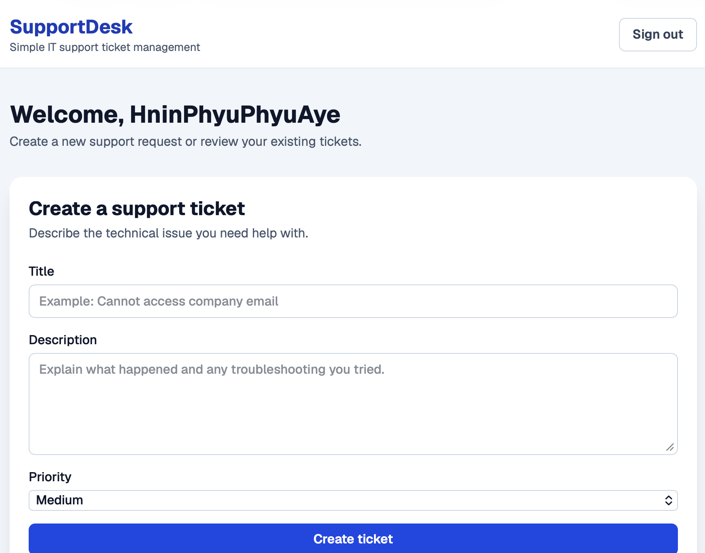
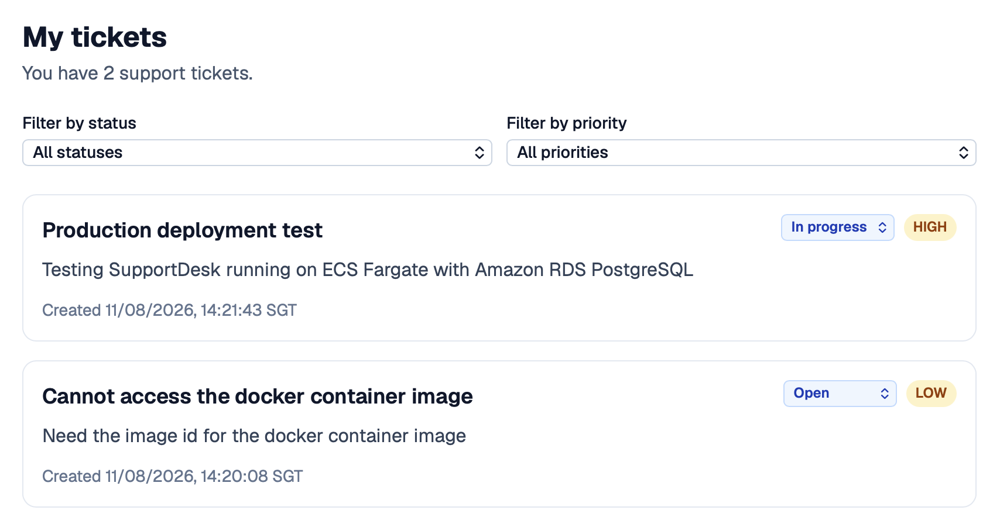
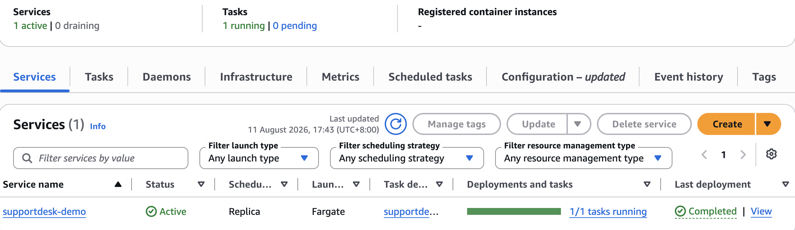
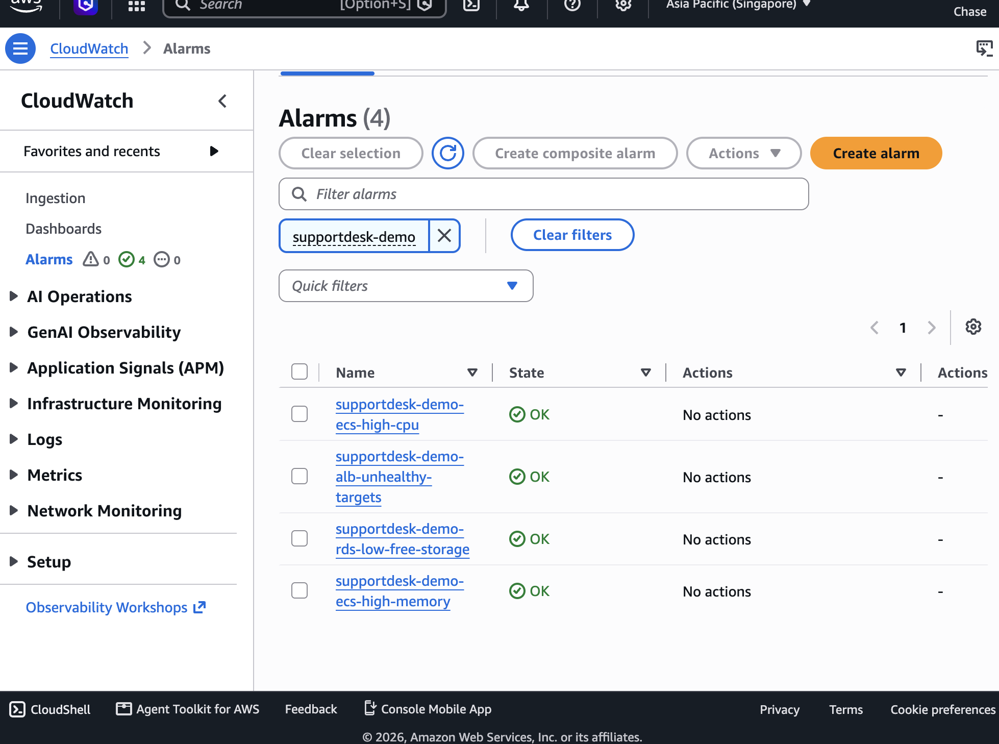
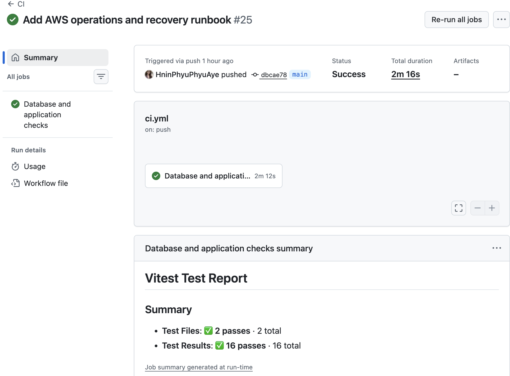

# SupportDesk deployment evidence

These screenshots document the verified portfolio deployment. They are cropped
to exclude AWS account identifiers, ARNs, endpoints, browser history, and secret
values.

## Application workflow

The authenticated interface supports ticket creation, priorities, workflow
status changes, and combined filtering.

## AWS runtime

The ECS Fargate service is active with one desired and running task, no pending
tasks, and a completed deployment.

Four standard CloudWatch alarms monitor ALB target health, ECS CPU and memory,
and RDS free storage. All four were healthy when this evidence was captured.

## Continuous integration

GitHub Actions applies migrations to an isolated PostgreSQL service, checks
formatting and TypeScript, runs automated tests, builds the production
application, and builds both application and migration containers.

